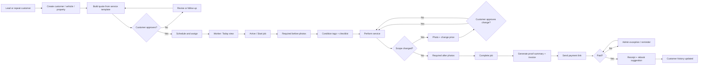
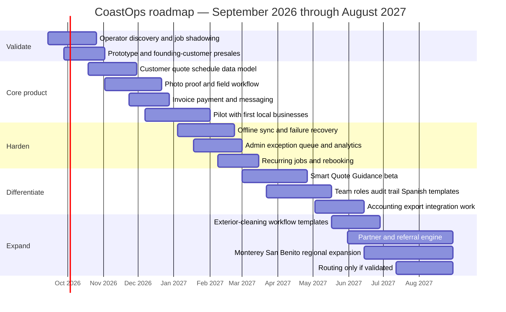

# Building a Polished Local-Business Management Service for Santa Cruz

## Executive summary and recommended product

**Recommendation: build a narrow “proof-to-pay” field-service operating system for one- to five-person mobile and exterior-service businesses, starting with mobile auto detailers/washers and pressure/window/gutter cleaners.** Do **not** build a general-purpose Santa Cruz version of Jobber or Housecall Pro. That category is already crowded by mature horizontal products and surprisingly capable vertical products such as Urable, QuoteIQ, OrbisX, and Mobile Tech RX. A working product name for this report is **CoastOps**. Its core promise is:

> **“Finish the job with proof, approval, and payment before you leave.”**

The differentiating workflow should be extremely focused: customer/asset → quote → schedule → before photos → work checklist → approved scope changes → after photos → invoice → payment → rebooking. The software should feel substantially faster and simpler in the field than a full field-service-management suite. It should combine this with unusually good local onboarding and support.

The product should contain machine-assisted pricing, but **“AI” should not appear in the positioning**. Day-one “Smart Quote Guidance” should primarily use explicit service templates, vehicle/property-size modifiers, condition, travel, estimated labor, materials, and minimum-charge rules. After a merchant has accumulated enough completed jobs, the system can incorporate its own historical job durations and realized prices and use a language/vision model to help categorize condition or explain a suggested range. The owner must remain the decision-maker.

This conclusion follows from four important market realities.

First, Santa Cruz County has a substantial small-business base: the Census Bureau reports **7,136 employer establishments and 22,789 nonemployer establishments for 2023**, implying a broad upper-bound universe of roughly **29,925 business establishments** before accounting for differences in Census definitions. Median household income was approximately $111,000, while the county's 2025 population estimate was about 259,000. Second, Santa Cruz is unusually exposed to small, service-oriented businesses but is not a high-growth small-business market. The county's 2025 Comprehensive Economic Development Strategy found that establishments with fewer than ten employees grew only **2.2% from 2017 through 2022, versus 10.5% statewide**; local stakeholders also identified regulation/licensing, commercial-space constraints, and hiring/retention under the county's high cost of living as barriers. The county's May 2026 outlook reported **7.2% unemployment in February 2026** and only modest recent employment growth. Third, the generic software feature set is already commoditized. Jobber, Housecall Pro, Square, Urable and QuoteIQ already cover significant combinations of quoting, scheduling, reminders, invoicing, payments, booking and dispatch; Urable even includes HD inspection photos and mobile routing. The opportunity therefore is **not more features**. It is better workflow, local implementation, lower switching friction and disciplined targeting.

Fourth, Santa Cruz alone is a good **beachhead, not the eventual market**. A sensitivity analysis illustrates the constraint: if the relevant field-service firms eventually prove to represent only 1–3% of the county's roughly 29,900-business broad universe, the local serviceable pool would be about 300–900 accounts. Even capturing 10% at $89/month produces only about **$32,000–$96,000 of subscription ARR**. Those are modeled assumptions rather than measured vertical counts, but they expose the core business risk. A product that works should expand into Monterey County, San Benito County and ultimately the broader Central Coast/Bay Area by the second half of year one.

**The highest-ROI path is therefore software plus bounded implementation service:** charge recurring SaaS fees, sell a one-time done-for-you setup, and initially offer an optional local operations package. The implementation revenue improves early economics and, more importantly, forces direct exposure to customers' actual workflows. Do not turn that package into an unlimited virtual-assistant business.

The most important pre-build gate is also clear: **do not spend four months engineering the full system before validating willingness to pay.** The current research uses secondary evidence and **does not include original interviews with Santa Cruz operators**. Before the main build, obtain 15–20 operator conversations, shadow at least five real jobs, and secure five paid pilots or deposits. The purpose is specifically to test whether “proof-to-pay” is painful enough to induce switching from texts + calendar + Square/QuickBooks, not merely whether operators say the concept sounds useful.

## Santa Cruz market and customer evidence

Santa Cruz County's economy is service-heavy and constrained by high operating costs. The county's 2025 CEDS identified Healthcare, Tourism/Hospitality/Recreation, Education/Knowledge, Retail, and Professional/Business Services as the five largest employment clusters, collectively accounting for **68.5% of county jobs in 2024**; retail and tourism/hospitality/recreation together represented 27.7%. The CEDS also classifies building/grounds-cleaning and personal-care occupations among the county's lower-paid employment tier, and reports that the county has a larger share of lower-paying Tier 3 jobs than California overall. The environment is economically difficult for precisely the owner-operators CoastOps would target. Santa Cruz's median home price reached roughly **$1.3 million in 2024**, while average monthly rent was approximately **$3,345** at the end of 2024; the county explicitly connects these costs with employee recruitment and retention problems. At the same time, the county's May 2026 economic outlook describes a local economy operating under national, state and federal pressure, despite 3.4% real GDP growth in 2024 following contractions in 2022–23. That combination argues for a product that helps a small operator **protect margin and cash flow**, rather than selling vague “productivity.”

| Santa Cruz market indicator | Latest researched value | Product implication |
|---|---:|---|
| Employer establishments | 7,136, 2023 | Meaningful local SMB base, but only a fraction are field services. |
| Nonemployer establishments | 22,789, 2023 | Very large solo/self-employed population relative to employer establishments; Solo must be a first-class product tier. |
| Broad establishment universe | ~29,925 | Useful upper bound only; not a field-service TAM. Derived from the two Census figures above. |
| County population | ~258,900, July 2025 estimate | Santa Cruz is large enough for product validation but too geographically bounded for aggressive SaaS scale. |
| Unemployment | 7.2%, February 2026 | Reinforces a mixed local operating environment rather than a boom market. |
| Small businesses under 10 employees | +2.2%, 2017–22 | Growth substantially lagged California's +10.5%, arguing against assumptions of rapid organic local market expansion. |
| Median home price | ~$1.3M, 2024 | High cost base contributes to hiring/retention pressure. |
| Average monthly rent | ~$3,345, end-2024 | Same margin/labor-pressure implication. |

A precise count of “mobile washers,” “mobile detailers” or similar microbusinesses should **not be fabricated from broad Census categories**. Employer counts can be obtained through County Business Patterns by NAICS, while Nonemployer Statistics cover businesses without paid employees; the Census explicitly provides industry-level subnational economic data through these programs. But mobile detailing can fall into car-wash/detailing categories, exterior cleaning spans several building-service categories, and many businesses are nonemployers. The City of Santa Cruz separately publishes a monthly active-business-license database, which is useful as a local lead source but covers a different administrative population. **The correct pre-launch market-sizing task is therefore record-level enumeration**, not another top-down TAM estimate: normalize the active-license database; pull relevant County Business Patterns and Nonemployer NAICS categories; sample Google Maps, Yelp/Instagram and local directories; deduplicate operators; and tag solo versus crew businesses. That should yield a real list of addressable prospects and can double as the first outbound-sales database.

The relative attractiveness of the target segments is more important than an imprecise total count:

| Segment | Evidence/photo fit | Recurring revenue potential | Workflow complexity | Competitive intensity | Priority |
|---|---:|---:|---:|---:|---:|
| Mobile auto detailers / washers | Very high | High | Moderate | Very high | **First** |
| Pressure, window and gutter cleaning | Very high | Moderate | Low–moderate | High | **Second** |
| Landscaping / lawn service | Moderate | Very high | High | Very high | Third |
| Residential / commercial cleaning | Moderate | Very high | High | Very high | Fourth |

The first two segments win because the proposed differentiation—visual proof, condition documentation, scope-change approval and rapid closeout—naturally fits the work. Urable itself prominently markets photo/video inspections as protection from liability and includes vehicle-image storage, job approvals, invoices and routing, which is evidence that this workflow has enough value for an established vertical vendor to devote substantial product surface to it. Mobile Tech RX similarly supports before/after documentation in automotive-service workflows. Landscaping and cleaning are larger expansion opportunities, but they pull the application toward recurring routing, shift assignment, team availability, timekeeping, property access instructions and more sophisticated dispatching. Urable already targets both lawn care and landscaping and provides routing, labor/time tracking and recurring jobs. Expanding there before the initial workflow is validated would unnecessarily broaden the MVP.

**Validated pain points are best described as a hierarchy of evidence, because no primary Santa Cruz interviews have been conducted for this report.**

The strongest general evidence comes from the Federal Reserve's Small Business Credit Survey. In its 2026 report, based on the 2025 survey, **reaching customers and growing sales was the most commonly reported operational challenge**, with hiring/retaining qualified staff second. In the preceding survey, **75% of employer firms reported rising costs of goods/services/wages as a financial challenge, 56% reported paying operating expenses, and 51% reported uneven cash flow**. Those are national employer-firm figures, not Santa Cruz-trade-specific results, but the Santa Cruz CEDS independently identifies local hiring/retention and cost-of-living constraints. The next layer is category evidence. Successful field-service products converge on quote → schedule → communicate → document → invoice → collect payment, while detailing-oriented products add vehicle profiles, photos/inspections and routing. That convergence does not prove which pain matters most in Santa Cruz, but it strongly suggests the underlying jobs are not hypothetical. Finally, user-community evidence is useful but explicitly anecdotal. Recent cleaning-business discussions describe fragmented stacks involving WhatsApp, Excel and paper; another cleaning operator reported scheduling difficulty once volume rose enough that traffic, cancellations and worker availability had to be coordinated. A moving-company owner similarly asked how to replace limited Google Calendar workflows with integrated quotes, deposits and invoicing. These discussions are neither random samples nor Santa Cruz-specific, so they should be treated as **qualitative problem discovery**, not prevalence statistics.

The resulting pain hierarchy to validate locally is:

| Pain hypothesis | Current evidence strength | Product response |
|---|---|---|
| Administrative fragmentation between texts, calendar, quote, job notes and billing | Medium-high | One job record from lead through payment |
| Slow or inconsistent cash collection | High at SMB macro level | Generate invoice automatically at job close; payment link immediately available |
| Margin pressure / uncertain pricing | High for cost pressure; **pricing-assistant demand itself is not yet validated** | Structured pricebook + historical quote guidance |
| Proving pre-existing condition and completed work | Medium-high for detailing category | Required before/after proof packet |
| Scheduling and route coordination | Medium | Basic calendar initially; routing only when crew density justifies it |
| Customer follow-up and repeat bookings | High for sales-growth problem; medium for specific mechanism | Automatic rebook reminders and repeat-job templates |
| Hiring / crew consistency | High nationally and locally | Checklists, role permissions, standardized job closeout rather than HR/payroll |

One local wrinkle is particularly relevant to mobile washing. Santa Cruz's stormwater program emphasizes that storm drains connect to local waterways and advises vehicle washing at commercial car washes when possible. A future mobile-washer template could therefore capture runoff/wastewater handling notes and site photos. It should be sold as **documentation and workflow support, not as a guarantee of environmental compliance**.

## Competitive landscape and positioning

The competitive environment is the biggest reason not to build a conventional all-in-one SMB platform.

Pricing below was checked against official vendor material available on **September 6, 2026**. Promotions and annual-billing discounts can change.

| Competitor | Current advertised pricing | Relevant capabilities | Strategic implication |
|---|---|---|---|
| **QuoteIQ** | Essentials $29.99/mo solo; Beginner $74.99; Pro $149.99/4 users; Elite ~$299; Max ~$699; annual billing saves two months | Estimates, invoices, scheduling, payments and increasingly broad home-service features | Very aggressive direct competitor on price and field-service breadth. |
| **Urable** | Express $70/mo; Pro $110; Enterprise $183; unlimited users | Quotes/invoices, reminders, Stripe/Square, HD inspection photos, routing, recurring jobs, employee assignment; online booking at Pro; video/workflows at Enterprise | The strongest warning against competing solely on detailing features. |
| **OrbisX** | Roughly $100/mo on its currently advertised single-plan offer | Detailing CRM, scheduling, quotes/invoices, payments, customer follow-up and operational tools | Another vertical replacement product; reinforces need for narrower differentiation. |
| **Mobile Tech RX** | Plans advertised from roughly $30/mo; more advanced/admin tiers substantially higher | Automotive-reconditioning workflows, estimating/invoicing and before/after documentation | Strong incumbent wherever vehicle-specific workflow matters. |
| **Jobber** | Core roughly $49/mo month-to-month for solo; Grow $199/mo solo; team tiers rise substantially; annual billing discounts available | Booking, quote, invoice/payment, schedule, reminders, checklists, profitability, files/media, workflows and marketing depending on tier | Extremely broad horizontal benchmark. Do not reproduce its roadmap. |
| **Housecall Pro** | Basic $79/mo; Essentials $189; MAX $329 on current monthly packaging; annual-effective pricing is lower | Scheduling/dispatch, estimates, invoices/payments, communications and integrations | Strong horizontal choice as firms add technicians; CoastOps must be materially simpler for a small crew. |
| **Square** | Free tier plus paid plans around $49 and $149/location on its current business-management packaging; transaction fees separate | Booking, payments, invoices, customer records and staff tools | Powerful “good enough” substitute, particularly for solos that do not need structured job execution. |
| **Joist** | Basics ~$10/mo, Pro ~$17, Elite ~$32; broader Run package ~$70 | Estimates, invoices, online payments, signatures, deposits; increasingly job-oriented tools | Establishes a very low price floor for operators who mainly need quote-and-invoice. |
| **ServiceTitan** | Custom/per-technician sales pricing | Deep dispatch, scheduling, invoicing, pricebook and larger operational stack | Not the initial target's natural price/complexity point, but a ceiling on how far CoastOps should expand upmarket. |

The implication is uncomfortable but useful: **before/after photos, invoicing, reminders, routing or “AI” are not defensible moats individually.** Urable already provides HD inspection photos, route optimization, job approvals, branded invoices and recurring jobs; QuoteIQ competes aggressively on integrated field-service workflow; Jobber's upper plans centralize job media and automate workflows. A winning product therefore needs a distinct product philosophy:

| Dimension | Conventional FSM | Recommended CoastOps |
|---|---|---|
| Initial target | Dozens of home-service trades | Mobile detail / exterior-cleaning owner-operators and small crews |
| Main object | Job/work order | **Proof-to-pay job packet** |
| Field interface | General job management | “What must I do next?” with one dominant action |
| Photos | Attachment/file feature | Required workflow stage with before/after grouping and condition tags |
| Pricing | Pricebook or manual quote | Structured pricebook plus owner-history guidance |
| Admin | Broad dashboard | Exceptions: unapproved change, missing proof, unpaid invoice, rebook due |
| Onboarding | Self-service or generic implementation | Local, done-for-you service-template and customer import |
| Marketing language | “All-in-one business platform” | “Finish the job and get paid before you leave” |
| Machine assistance | Often marketed as AI | Invisible infrastructure behind “Quote Guidance” |
| Expansion | Add more modules | Add adjacent vertical templates only after retention proves the core loop |

Searches for this report did not surface a clearly established **Santa-Cruz-native field-service-management SaaS vendor**. That is a search finding, not proof that none exists. The local competition is more realistically national software plus spreadsheets, Google Calendar, payment/accounting products and local consultants/service providers. Santa Cruz's public ecosystem does provide startup and small-business support, and the CEDS identifies organizations including SBDC and El Pájaro CDC as entrepreneurship resources. The moat, if one emerges, is therefore likely to be **distribution + onboarding data + workflow quality**, not a proprietary technical feature.

## Product design, MVP and workflows

The MVP should be aggressively constrained around one operational loop. Every feature should either shorten time from inquiry to accepted job, reduce mistakes during execution, reduce time to payment, or encourage a repeat booking.

| Priority | Feature | What “done” means | Why it belongs |
|---|---|---|---|
| **MVP core** | Customer + asset/property profile | One customer can own multiple vehicles/properties with notes and history | Avoid re-entering job context |
| **MVP core** | Service catalog / pricebook | Base price, expected duration, size/vehicle modifiers, add-ons and minimum charge | Foundation for consistent quoting |
| **MVP core** | Quote + approval link | Quote created on phone in under ~60 seconds from a template; customer can accept remotely | Removes text-message ambiguity |
| **MVP core** | Basic schedule + assignment | Today/week view, worker assignment and simple recurring job | Enough dispatch for 1–5 people |
| **MVP core** | Before-proof workflow | Configurable required photo angles, issue/condition tags and notes | Core differentiation |
| **MVP core** | Checklist + scope change | Worker can document additional work and request customer approval before proceeding | Protects margin and disputes |
| **MVP core** | After-proof workflow | Completion photos grouped next to before photos | Creates customer-facing proof packet |
| **MVP core** | Invoice + payment | Approved quote becomes invoice; hosted payment page opens from SMS/email | Compresses closeout |
| **MVP core** | SMS/email state messages | Confirmation, reminder, on-my-way, payment receipt | Reduces repetitive admin |
| **MVP core** | Admin exception queue | Missing proof, awaiting approval, unpaid invoice, overdue quote | Admin works exceptions rather than browsing every job |
| **Next** | Repeat/rebook automation | Suggested next service interval and one-tap repeat booking | Recurring revenue for merchant and greater app stickiness |
| **Next** | Offline capture/sync | Photos/checklists continue without usable data service and sync reliably later | Important field-quality requirement |
| **Next** | Smart Quote Guidance | Range + rationale + confidence based mainly on merchant's own data | Margin assistance without handing pricing authority to a model |
| **Next** | Role permissions/audit log | Owner/admin/worker access plus history of critical actions | Needed as teams grow |
| **Next** | Spanish customer/admin templates | Local onboarding, reminders and core customer communications available bilingually | Better fit for Santa Cruz County's diverse business community; the county reports a substantial Latino population. |
| **Later** | Route optimization | Only after multi-crew customers prove routing is a retention driver | Existing vendors already do this well |
| **Later** | QuickBooks deep sync | Add after finance-export demand becomes repetitive | Integration complexity is high relative to initial differentiation |
| **Later / likely never** | Payroll, full bookkeeping, website builder, phone system, deep inventory | Integrate rather than recreate | These features drag CoastOps directly into incumbent territory |

**Pricing assistance needs unusually disciplined product design.** At launch, the system should not claim that a photo can “know” what a job should cost. That is a brittle promise and ignores the fact that price depends on labor efficiency, target margin, travel, service quality, materials and the operator's positioning.

A better first-generation model is:

`base service + size/asset modifier + condition modifier + approved add-ons + travel adjustment`, subject to a merchant-defined minimum.

The UI can then show:

**Suggested range: $205–$235**  
Your normal full-detail base: $185  
SUV size adjustment: +$20  
Heavy interior condition: +$20–$30  
Travel: +$10  
Recent similar jobs: $210, $225, $230  
**Confidence: medium**

After perhaps 20–30 completed comparable jobs for that merchant, historical duration, actual charge, accepted upsells and rework can begin influencing the range. That threshold is a product-design assumption to test, not a statistically established cutoff.

A model can assist behind the scenes by extracting likely condition tags from photographs or converting free-text job notes into structured modifiers. **It should never autonomously send a price, change a merchant's pricebook, or use confidential prices from other CoastOps merchants to coordinate recommendations.** The product should emphasize the merchant's own data and explicit business rules.

That gives field workers a nearly linear experience:

The **field UX** should optimize for sunlight, wet/gloved hands, intermittent connectivity and one-handed use rather than traditional desktop-software density. A worker's default screen should be “Today,” not a miniature CRM. At each job there should be one obvious next action: Navigate → Arrive → Before → Work → After → Finish → Collect.

Photos should upload opportunistically in the background instead of blocking the worker. The UI should retain local thumbnails and upload status, show failed uploads prominently and allow the job to continue offline. Expo's current platform supports a single JavaScript/TypeScript project across native devices, while its documented local-first architecture explicitly supports reading/writing locally while offline and synchronizing later. The **admin UX** should be exception-driven. The home screen should answer five questions immediately: what is happening today, which quotes need action, which jobs have an exception, who owes money, and which customers are due for repeat service. A small service company does not need a BI dashboard with 40 metrics. It needs to know what requires intervention.

Key product metrics should reflect the actual workflow: time to first completed job after signup; percentage of jobs containing required proof; quote acceptance; time between job completion and invoice send; percentage paid within 24 hours; repeat booking rate; weekly active businesses; support minutes per account; 30/90/180-day logo retention; and number of jobs per active account. Revenue is the business metric; **completed proof-to-pay loops are the product's leading indicator.**

## Architecture, data and compliance

The technical architecture should optimize for **reliability and iteration speed rather than infrastructure novelty**.

The recommended stack is:

| Layer | Recommended choice | Alternative | Reasoning |
|---|---|---|---|
| Field application | **Expo / React Native / TypeScript** | Responsive Next.js PWA | Camera, native mobile behavior and offline operation are central enough to justify native-capable tooling. Expo supports iOS, Android and web from a JS/TS project. |
| Admin web | Initially Expo web or a small **Next.js/TypeScript** surface | Full separate React SPA | Avoid two large applications until admin complexity demands it |
| Database | **Managed PostgreSQL**, e.g. Supabase | Neon/RDS + custom backend | Relational model fits customers/jobs/quotes/payments; Supabase exposes native Postgres RLS for granular authorization. |
| Auth/tenant isolation | Managed auth + `tenant_id` everywhere + database RLS | Custom OAuth/session layer | Prevent tenant-leak bugs at both application and DB layers |
| Photos/files | **S3-compatible private object storage** | Supabase Storage | Direct signed uploads reduce application-server load; AWS documents time-limited presigned upload/download access. |
| Payments | **Stripe Connect + Stripe-hosted checkout** initially | Square integration | Businesses can collect their own customer payments without CoastOps building a card-data system; Stripe explicitly supports SaaS platforms whose businesses collect from their own customers. |
| Messaging | Twilio or another established SMS provider + transactional email | Direct carrier complexity | Centralize consent, templates, delivery status and opt-out handling |
| Mapping | Native maps / Google Maps integration | Mapbox | Only navigation in MVP; optimization later |
| Machine assistance | Provider abstraction behind a small structured “quote assist” service | Single provider hard-coded everywhere | Easier privacy controls, cost measurement and provider replacement |
| Observability | Error tracking + structured logs + uptime checks + audit events | — | Critical for a field workflow where silent sync failure destroys trust |

A heavier Django/FastAPI or custom microservice architecture is not justified initially. PostgreSQL, a thin application/API layer, object storage and a background-job queue are sufficient. The domain model should be portable enough that managed-service vendors can later be replaced without rewriting business logic.

A sensible core schema is approximately:

`business → user → customer → asset/property → lead → quote → job → job_step → photo → scope_change → invoice → payment → rebook`

with service templates, price modifiers, message events and audit events alongside it. Every customer-visible/business-owned record needs an explicit tenant identifier. Access policies should be tested as part of CI; Supabase's own current guidance recommends RLS on exposed tables and describes it as database-level granular authorization. Photos deserve special treatment. They may contain license plates, addresses, people, interiors, geolocation or other information linkable to individuals. California's CCPA expressly defines personal information broadly enough to include names, purchase records, geolocation and inferences, with precise geolocation classified as sensitive personal information. Design recommendations are therefore to strip unnecessary EXIF metadata, make original GPS retention opt-in rather than accidental, separate public/customer-share URLs from internal storage keys, expire signed links, log access and permit merchant-configurable retention. A reasonable initial default would be a 24-month job-photo retention period, but that is a product policy to validate with customers and counsel rather than a statutory requirement.

**California privacy obligations should be designed for before CoastOps is large enough to trigger the full CCPA.** As of September 2026, the CCPA applies to covered for-profit businesses doing business in California that meet thresholds including at least **$26.625 million in preceding-year gross annual revenue**, buying/selling/sharing personal information of at least 100,000 California residents or households, or deriving at least 50% of annual revenue from selling/sharing California residents' personal information. Importantly, the former exemptions for employee and business-to-business personal information expired at the end of 2022. An early CoastOps startup will ordinarily be far below the revenue threshold under the proposed model, but that is not a reason to ignore privacy engineering. California's Online Privacy Protection Act separately requires qualifying commercial websites/online services collecting personally identifiable information from California consumers to make a privacy policy available and specifies categories of required disclosures. The operationally simpler approach is to implement deletion/export primitives, retention controls and subprocessor records while the database is still small.

The CPPA's finalized regulations on automated decision-making technology, risk assessments and cybersecurity audits became effective **January 1, 2026**, with certain obligations phased into 2027 and 2028; ADMT-specific rights focus particularly on significant decisions such as employment, housing, financial services, education and healthcare. Merchant-facing quote guidance for a car wash or cleaning job is qualitatively different from those listed significant-decision uses, but the product should be reviewed again if it ever uses automation for worker hiring, employment decisions, financing or other consequential decisions.

**Messaging consent is another non-negotiable.** FCC rules on unwanted robocalls/robotexts require consent-revocation requests to be honored within a reasonable period not exceeding ten business days, and the FCC has continued to tighten treatment of revocation. CoastOps should maintain consent state per customer and channel, automatically process STOP-style revocation, distinguish operational messages from promotional campaigns and keep an auditable message log. Marketing campaigns should be a later feature precisely because they increase compliance complexity.

**Do not touch raw card data.** PCI SSC distinguishes implementations in which account-data functions are completely outsourced to compliant third parties, and its current guidance specifically distinguishes redirects or fully outsourced payment flows from merchant-hosted payment-page components. Stripe Connect provides SaaS-platform patterns in which connected businesses accept customer payments through Stripe-hosted Checkout. This is preferable to building custom card capture.

The minimum security baseline should include tenant isolation; MFA availability for business owners; encrypted transport/storage through managed infrastructure; secret rotation; signed/expiring photo URLs; audit events for quote changes, customer approvals, deletions and refunds; tested backups; a documented incident-response process; least-privilege support access; and automated dependency/security updates. These are architectural recommendations rather than claims that a specific law mandates each control.

## Business model, go-to-market and revenue economics

The recurring subscription should remain the economic core. **Do not make transaction take-rate the main business model.** Payment volume is seasonal and volatile, it creates more merchant friction, and the value proposition does not depend on becoming a payments company. Let Stripe/Square charge ordinary processing fees directly wherever possible.

Recommended launch pricing:

| Offer | Price | Included | Purpose |
|---|---:|---|---|
| **Solo** | **$49/mo** | 1 worker/admin, full proof-to-pay workflow, basic reminders, payments | Matches Jobber's entry neighborhood while remaining above bargain invoice-only tools |
| **Team** | **$89/mo** | Up to 3 users, assignments, recurring jobs, expanded automations | Likely core plan |
| **Crew** | **$139/mo** | Up to 7 users, richer roles/reporting/workflows | Expansion tier without becoming enterprise FSM |
| **Local Launch setup** | **$299 one-time** | Customer CSV import, pricebook/template setup, branding, payment connection, first-job training | Converts onboarding labor into revenue and increases activation |
| **Local Ops add-on** | **$99/mo** initially | Bounded workflow/pricebook maintenance, quarterly operational review, priority local help | High-touch early recurring income; strictly scoped |
| Annual billing | ~10 months for 12 | Same software | Cash-flow and retention incentive after product-market signal |

The pricing is deliberately bracketed by existing alternatives. Jobber starts around the same broad solo price point but becomes much more expensive as functionality/team size increase; Urable charges $70/$110/$183 with unlimited users; QuoteIQ starts much lower at $29.99 but reaches $149.99 at its four-user Pro tier. CoastOps therefore cannot win a feature-per-dollar spreadsheet comparison. It has to win because the owner gets implemented quickly and the job-closeout workflow is materially better.

The first sales persona should be unusually specific:

**Owner-operated service business; one to five workers; at least roughly 10 jobs/month; customers currently managed with some combination of text/phone, calendar, spreadsheet, Square/QuickBooks or a disliked FSM; typical work includes visual condition and an on-site closeout; owner is still involved in quotes or collections.**

Those thresholds are targeting hypotheses, not measured Santa Cruz distributions. Brand-new side hustles with three monthly jobs are likely high-churn and low-value. Ten-plus-person service companies already needing sophisticated capacity planning are likely better served by mature FSM products.

A Santa Cruz go-to-market engine should combine high-touch outbound with trusted local channels.

**The founding cohort should be the main launch mechanism.** Build a prospect list from the city's monthly active-license database, county/business directories and manual mapping of relevant service operators. Approach the first 50–100 prospects personally, ideally with a 90-second demo built around a real example job rather than a generic CRM walkthrough. Offer the first 20 businesses a locked founding price in exchange for structured feedback and permission—where deserved—to develop a case study.

**Local ecosystem partners should supply trust, not be treated as magical distribution.** Santa Cruz's economic-development ecosystem includes Small Business Development Center resources, while El Pájaro CDC has historically provided bilingual/bicultural business education and technical assistance across Santa Cruz, San Benito and Monterey counties. Useful programs would be practical workshops such as “Get from estimate to paid in one field visit” rather than software sales presentations.

For the initial vehicle-care niche, additional distribution experiments should include detailing-supply businesses, fleet operators, car dealerships, independent repair/detail shops and complementary service businesses. For exterior cleaning, property managers, realtors and contractor networks become relevant. These are channel hypotheses to test rather than researched claims about existing partnerships.

**Onboarding itself should be a product.** A new business should be live within one session:

1. Import customers or start clean.
2. Load three to ten common service packages.
3. Configure price modifiers and minimum charge.
4. Add logo and invoice/payment details.
5. Connect Stripe.
6. Select reminder/on-my-way templates.
7. Configure required before/after photos.
8. Run a simulated job.
9. Schedule the first real customer.

The activation target should be **first completed proof-to-pay job within 48 hours of account creation**. If customers routinely fail this step, adding more features will not solve retention.

The initial GTM funnel should use operational gates rather than vanity leads: contacted → discovery → live demo → paid pilot → first completed job → five completed jobs → retained at 30/90 days → referral.

### Modeled revenue scenarios

The following are **planning models, not forecasts**. Subscription revenue assumes gradual customer acquisition through the year rather than all customers being present from January. “Gross margin” is modeled before founder salary and excludes merchant payment-processing fees passed directly through to merchants. CAC includes direct sales/marketing expenditure but not founder time. Because no real retention cohort exists, presenting a conventional SaaS lifetime-value number would create false precision; 12-month gross-profit/CAC is more defensible.

| Assumption / result | Conservative | Realistic | Optimistic |
|---|---:|---:|---:|
| End-of-year paying accounts | 35 | 100 | 250 |
| Geography | Santa Cruz primarily | Santa Cruz + Monterey/San Benito beginning H2 | Central Coast + early Bay Area expansion |
| Average active accounts during year | 17.5 | 52 | 120 |
| Blended monthly subscription ARPA | $69 | $89 | $99 |
| Monthly logo churn assumption | 3.0% | 2.0% | 1.5% |
| Subscription revenue in first 12 months | **$14,490** | **$55,536** | **$142,560** |
| Setup attach assumption | 60% × $299 | 60% × $299 | 55% × $349 |
| Setup revenue | **$6,279** | **$17,940** | **$47,988** |
| Approx. first-year revenue | **$20,769** | **$73,476** | **$190,548** |
| Exit MRR | **$2,415** | **$8,900** | **$24,750** |
| Exit subscription ARR run rate | **$28,980** | **$106,800** | **$297,000** |
| Modeled software gross margin | 78% | 84% | 87% |
| Blended CAC | $250 | $180 | $120 |
| 12-mo subscription gross profit per account at stated ARPA | ~$646 | ~$897 | ~$1,034 |
| 12-mo GP / CAC | **2.6×** | **5.0×** | **8.6×** |
| Subscription gross-margin CAC payback | ~4.6 mo | ~2.4 mo | ~1.4 mo |

The optimistic declining-CAC assumption depends on referrals and partner distribution actually working; it should not be budgeted as a certainty. Likewise, the 1.5–3% monthly churn assumptions need immediate replacement with actual cohort data after launch.

The **realistic case is the strategically useful target**: about 100 active accounts and roughly $8,900 of software MRR by the end of year one. It is enough to demonstrate an economically meaningful product without assuming impossible Santa Cruz penetration, but it almost certainly requires regional expansion in the second half of the year.

The conservative scenario exposes why **Santa Cruz-only software is not an attractive endpoint**. Thirty-five businesses at $69/month are useful validation and side-income, but not a compelling standalone software company.

The optimistic case, at roughly $25,000 MRR exit, would support hiring and more systematic regional growth, but reaching 250 customers in twelve months would require a repeatable channel rather than founder-by-founder selling.

The **Local Ops add-on is deliberately omitted from these revenue scenarios**, making them somewhat conservative relative to the proposed hybrid business model. That service should initially be treated as a separate experiment. If ten customers pay an additional $99/month, it adds $990 MRR; if delivering it consumes more than roughly one hour per customer per month, the service should be redesigned, automated or repriced. The objective is recurring implementation leverage, not building a low-margin agency hidden inside a SaaS company.

## Roadmap, staffing, costs and risk management

The roadmap should delay broad feature expansion until three uncertainties are reduced: willingness to switch, field-workflow quality and retention.

The first six weeks are not “lost development time.” They are the highest-leverage part of the roadmap. Existing competitors already demonstrate that the category has demand; the unanswered question is whether a narrow workflow can overcome switching costs.

**A hard validation gate should precede the full MVP:** at least 15 relevant conversations, five observed/closely reconstructed jobs, five businesses willing to pay rather than merely test for free, and repeated evidence that the proof-to-payment workflow ranks among their top operational irritations. A customer saying “photos would be cool” does not satisfy the gate.

By the end of the pilot period, require evidence that at least five merchants can complete jobs without founder intervention, that photo uploads survive poor connectivity, and that invoices/payment links are routinely sent at job close. By month six, retention is more important than signups.

A lean team is sufficient:

| Role | Timing | Capacity | Responsibility |
|---|---|---:|---|
| Founder / senior full-stack engineer-product lead | Entire year | 1.0 FTE | Product, architecture, customer discovery, early sales |
| Product designer contractor | Months 1–4, then intermittent | ~0.2–0.3 FTE | Field UX, visual polish, design system, usability testing |
| Local onboarding/GTM operator | From months 4–5 | ~10–20 hr/week | Setup, training, outbound, partner relationships |
| Legal/privacy counsel | Milestones | Project basis | Terms, privacy, SMS/payment/California review |
| Second engineer | **Do not hire initially** | — | Trigger only when customer/support/load data proves founder engineering is bottleneck |

A practical modeled cash budget is:

| Cost category | Bootstrap 12-month estimate | Notes |
|---|---:|---|
| Founder salary/draw | $0 cash / substantial opportunity cost | Bootstrap case |
| Design/UI contractor | $10k–$15k | Spend where “polished” actually affects field adoption |
| Part-time local GTM/onboarding | $15k–$25k | Begins after prototype/pilot |
| Hosting, database, storage, messaging, model/API usage, dev tools | $8k–$15k | Expected to rise with photos/SMS/customer count |
| Legal/privacy/accounting | $5k–$10k | Particularly payments, SMS, terms and privacy |
| Local events/materials/paid acquisition experiments | $5k–$10k | Keep spend tied to measurable acquisition |
| Contingency | $8k–$12k | Devices, integrations, contractor work, unexpected vendor costs |
| **Bootstrap external cash** | **~$51k–$87k** | Founder compensation excluded |
| Founder living draw, if budgeted at $6k/mo | +$72k | Planning assumption, not a salary benchmark |
| **Lean funded cash requirement** | **~$123k–$159k** | Still a one-founder product organization |

The main technical operating cost is unlikely to be PostgreSQL rows. Photos, SMS, third-party APIs and human onboarding are more important to watch. Object storage itself is usage-priced, and AWS supports direct presigned uploads that can avoid routing image bytes through the application server. Design image compression, thumbnail generation, retention and message quotas before scale makes them painful.

The major risks are not evenly weighted:

| Risk | Severity | Why it matters | Mitigation / decision rule |
|---|---|---|---|
| **Santa Cruz market too small** | Critical | Broad business count greatly overstates the field-service niche | Treat Santa Cruz as test market; start regional expansion once ~30–50 local paying customers or local acquisition begins saturating |
| **Incumbents already satisfy the problem** | Critical | Urable, QuoteIQ, Jobber and others already have most obvious features. | Sell workflow simplicity + implementation; kill product if five paid pilots cannot articulate clear switching value |
| **Trying to build full FSM** | High | Schedule, dispatch, marketing, payroll, accounting, inventory and phones create an enormous roadmap | Keep a written “not building” list; integrate commodity systems |
| **Side-hustle/customer churn** | High | Nonemployer base is large, but very small operators can disappear or downgrade quickly. | Qualify for consistent job volume; measure 90/180-day retention; encourage annual only after demonstrated activation |
| **Pricing suggestions damage margins/trust** | High | Sparse merchant data and condition ambiguity make confident automation dangerous | Deterministic floors, ranges, confidence, explicit factors and mandatory owner approval |
| **Field app loses photos/data** | High | One failed proof packet can destroy trust in the core differentiator | Offline queue, durable local state, checksums/retry, explicit upload status, automated sync testing |
| **High-touch service destroys software margins** | High | Local concierge can become an unbounded agency | Fixed onboarding checklist, scope limits, measure support minutes/account, price bespoke work separately |
| **Privacy/payment/messaging mistakes** | High | Product handles customer identity, photos, texts and payment workflows | Hosted payment flow, tenant isolation, consent ledger, privacy controls and legal review; CCPA/CalOPPA/FCC requirements designed in early. |
| **Environmental-compliance overclaim** | Medium | Mobile washing intersects Santa Cruz stormwater concerns. | Provide configurable documentation/checklists; never market the software as certifying legal compliance |
| **Machine-assistance becomes the product story** | Medium | Competitors can copy model features and customers may distrust automated pricing | Brand around better operations; model features remain invisible implementation details |
| **Vendor lock-in** | Medium | Payments, model and messaging vendors change price/policy | Keep domain data in Postgres, customer export first-class, isolate vendor adapters |
| **Polish consumes validation budget** | Medium | Excellent UI cannot repair weak demand | Polish the field loop heavily; keep back-office breadth intentionally plain until retention is proven |

The most important risk is **not technical failure**. It is building a polished version of something Santa Cruz operators can already obtain from Urable, QuoteIQ, Jobber, Housecall Pro or a cheap Square/Joist stack. The competitor research makes that a real possibility, not a theoretical caution. That changes the final recommendation from “build a local SMB management platform” to a much narrower proposition:

**Build CoastOps Proof-to-Pay first.** Target mobile detailers/washers and closely related exterior-service operators. Make the photographic job record, scope approval and one-tap closeout dramatically better than a generic CRM. Use basic scheduling rather than sophisticated dispatch. Use Stripe-hosted merchant payments rather than creating payments infrastructure. Sell $49/$89/$139 subscriptions plus a $299 implementation package. Keep pricing intelligence behind “Smart Quote Guidance,” grounded primarily in each merchant's own pricebook and job history. Acquire the first 20 customers manually in Santa Cruz, then expand geographically rather than broadening the feature set.

The key business thesis is ultimately **distribution and workflow, not AI and not feature breadth**. Santa Cruz provides a tractable market in which a founder can meet customers in person, observe field work, deliver unusually good onboarding and earn the first recurring revenue. The county's large population of nonemployer establishments makes that experiment credible, while its slow small-business growth and finite population make regional expansion mandatory if the objective is durable full-time income rather than a small local side business.